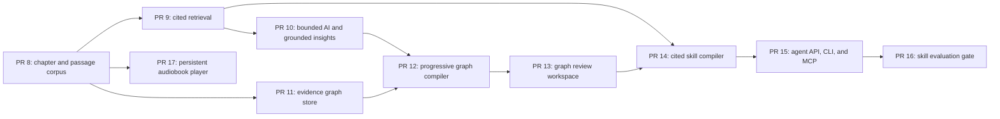

# ScribeSkill: the next 10 pull requests

Status: in progress; PR #8 is open and PR #9 is implemented as a stacked change
Last updated: 2026-08-17

## Outcome

These ten pull requests turn the current PDF reader and audiobook foundation into the flagship ScribeSkill workflow:

> Give ScribeSkill a permitted PDF and receive a portable, cited skill that can route a human or agent to the right book context, inspect an evidence-backed knowledge graph, answer grounded questions, and play the book through a persistent audiobook experience.

The skill is not a book summary. It is an operational navigation guide. Given a task, it selects a bounded combination of chapters, passages, figures, tables, and graph neighborhoods; explains how to apply that context; cites the original evidence; and says when the book does not support an answer.

The proposed PR numbers below are sequencing labels. GitHub may assign different numbers if another PR lands first.

## Starting point and merge prerequisite

Before this sequence begins:

1. Merge PR #6, the desktop asset MIME fix.
2. Merge or retarget PR #7, the desktop home and workspace redesign.
3. Re-run `pnpm check` from the resulting base branch.

The implementation already has stable PDF evidence anchors, a local SQLite workspace, an accessible reader, editable page-based sections, narration providers, resumable audiobook production, and preliminary skill-navigation contracts. The missing center is the real compiler: semantic chapters, cited retrieval, a durable evidence graph, portable skill artifacts, and agent-complete interfaces.

## Delivery principles

Every PR in this roadmap must preserve these invariants:

- **Evidence before synthesis.** Every accepted claim, graph relationship, answer, route, narration part, or export resolves to one or more source anchors. Unsupported statements are labeled rather than disguised.
- **Local first.** Import, storage, lexical retrieval, review, and export work without network access. Offline mode is enforced and tested, not merely described.
- **Progressive and resumable.** A user can work with one chapter while later chapters are still being processed. Expensive jobs can pause, cancel, retry, and resume without duplicating completed work.
- **Provider neutral.** Codex-session execution, BYOK services, and local OpenAI-compatible endpoints implement one bounded job contract. No execution path silently falls back to another.
- **Agent-native parity.** Important workflows use the same versioned domain contracts from UI, HTTP API, CLI, and MCP surfaces.
- **Derived data stays reviewable.** Parser proposals, AI answers, graph edges, and generated skill routes never overwrite source truth.
- **Useful, not merely complete.** Passing unit tests is necessary but insufficient. Every PR must demonstrate a real user or agent outcome.

## Dependency map



PR #17 can be developed in parallel after PR #8 stabilizes the chapter and passage model. PRs #8–#16 remain the critical path for the PDF-to-skill MVP.

## Summary

| Proposed PR | Deliverable | Depends on | User-visible proof |
| --- | --- | --- | --- |
| #8 | Semantic chapter and passage corpus | Current merge train | A real book gets an editable, stable chapter map instead of page-shaped sections. |
| #9 | Local cited retrieval | #8 | Search returns inspectable passages and exact page/region evidence offline. |
| #10 | Bounded AI execution, grounded Q&A, and insights | #9 | Codex/BYOK/local execution answers only from cited book context and saves provenance. |
| #11 | Versioned evidence-graph store | #8 | Nodes and edges survive restart, remain source-linked, and become stale when evidence changes. |
| #12 | Progressive knowledge-graph compiler | #10, #11 | A book graph builds chapter by chapter with budgets, review states, and resumable jobs. |
| #13 | Knowledge-graph review workspace | #12 | A user can inspect, repair, merge, reject, and navigate graph claims back to the PDF. |
| #14 | Portable cited-skill compiler | #9, #13 | One action emits a validated skill directory that routes tasks to bounded book context. |
| #15 | Agent-complete API, CLI, and MCP | #14 | An agent completes import → graph → skill export without using the UI. |
| #16 | Skill evaluation and usefulness gate | #15 | A published scorecard proves citation, routing, refusal, security, and human usefulness. |
| #17 | Spotify-style persistent audiobook player | #8 | Playback continues across parts, follows evidence, and resumes after restart. |

## PR #8 — Build the semantic chapter and passage corpus

### Goal

Replace the current mostly page-based guide with a durable book structure that retrieval, graph extraction, skill routing, and audiobook playback can all share.

### Scope

- Add versioned `Chapter`, `Section`, and `Passage` records to SQLite.
- Detect table-of-contents entries and heading candidates using deterministic layout and text heuristics first.
- Propose nested chapter/section ranges with confidence and an explanation of the signals used.
- Split reading-order text into stable, citation-ready passages without losing page, bounding-box, character-span, or extraction-revision anchors.
- Let users rename, merge, split, reorder, include, or exclude proposed sections while preserving source truth.
- Mark image-only and low-quality regions as `ocr-required` or `review-required` rather than inventing content.
- Version derived structure so later source repairs invalidate only affected passages, graph claims, audio, and skill routes.
- Add the user's local *Good Strategy/Bad Strategy* PDF as an uncommitted golden-book test input; keep repository fixtures synthetic or redistribution-safe.

### Non-goals

- Provider-backed OCR.
- AI-authored chapter summaries.
- Whole-book graph extraction.

### Acceptance and verification

- `pnpm check` passes, including migration, deterministic-ID, edit, restart, and source-revision tests.
- A digital multi-column fixture produces stable passage IDs and correct reading order across two imports.
- An image-only fixture stops with a precise OCR requirement.
- The golden book produces a usable, editable chapter map whose accepted boundaries survive app restart.
- Existing annotations and audiobook evidence remain resolvable after migration.

### Is this genuinely useful?

A reader can open a real strategy book and navigate meaningful chapters instead of raw pages. An agent can request one stable chapter or passage without loading the entire PDF.

## PR #9 — Add local cited retrieval

### Goal

Make the book searchable as evidence before adding generative answers.

### Scope

- Add local full-text indexing over accepted passages, initially with SQLite FTS5 or an equivalently inspectable local index.
- Implement a provider-neutral `search.query` contract with query, filters, result limit, context budget, and source-revision constraints.
- Return ranked passages with exact anchors, chapter location, extraction quality, snippets, score explanation, and source-vs-derived labels.
- Support filters for chapter, page range, figure/table presence, review state, and source revision.
- Add an evidence inspector that opens a result at the correct PDF page and highlighted region.
- Treat indexed book text as untrusted data, never as executable agent instructions.
- Create a small retrieval-evaluation set from synthetic fixtures and a private golden-book query set.

### Non-goals

- Generated answers.
- Mandatory embeddings or a vector database.
- Internet search.

### Acceptance and verification

- Offline tests instrument network access and observe zero requests.
- Search results are deterministic for a frozen corpus and remain within the requested context budget.
- At least 18 of 20 golden-book queries return a relevant cited passage in the top five; misses are documented rather than hand-waved.
- Clicking every tested result opens the correct page/region and source revision.
- Prompt-injection-shaped source text is returned as quoted evidence and never changes tool behavior.

### Is this genuinely useful?

A reader can find where the author develops an idea and inspect the original wording in one step. An agent can acquire bounded, source-linked context without an LLM or API key.

### Implementation note — 2026-08-17

Implemented as the next stacked slice: a revision-pinned `search.query` contract, incremental SQLite FTS5 source index, exact evidence inspector, explicit accepted/proposed scope, whole-passage character budgets, injection-shaped fixture coverage, and a frozen 20-query evaluation. The private *Good Strategy/Bad Strategy* golden-book run remains a local verification step because that PDF was not found in the workspace or indexed device search.

## PR #10 — Add bounded AI execution, grounded Q&A, and saved insights

### Goal

Turn cited retrieval into trustworthy inquiry while making Codex-session execution a real workflow, not only a capability probe.

### Scope

- Define one bounded text-execution contract for Codex SDK sessions, user-provided OpenAI-compatible endpoints, and local endpoints.
- Expose capability, login/key requirement, allowed host, model, token/turn budget, selected evidence, cancellation, progress, and execution receipt.
- Use retrieved passages as the only book context for grounded question answering.
- Require claim-level citations and distinguish quoted evidence, model synthesis, user notes, and unsupported conclusions.
- Refuse or ask for a broader search when the selected evidence cannot support an answer.
- Save optional questions, answers, selected passages, model/provider metadata, receipts, and user-authored insights in SQLite.
- Add inspect, edit, export, and delete flows for saved insights.
- Keep Codex plan/session use explicit: a logged-in Codex session may run bounded text jobs without a separate API key, but it is not a voice provider and no subscription entitlement is assumed by the app.

### Non-goals

- Autonomous graph extraction.
- Hosted accounts or cloud sync.
- Invisible provider fallback.

### Acceptance and verification

- Fake-provider tests cover success, timeout, budget exhaustion, cancellation, malformed citations, unsupported answers, and redacted receipts.
- A logged-in local Codex smoke journey answers a golden-book question with inspectable citations and no separate API key.
- BYOK and local-endpoint journeys use the same result schema.
- Offline mode prevents Codex and remote-provider execution while preserving retrieval and saved local notes.
- Every displayed factual answer has an inspectable citation or an explicit unsupported label.

### Is this genuinely useful?

A user can ask “What does the author mean by a kernel of strategy?” and move from the answer to the exact supporting pages. The saved insight remains understandable later because its evidence and execution provenance travel with it.

## PR #11 — Create the versioned evidence-graph store

### Goal

Establish a durable, inspectable knowledge-graph model before asking AI to populate it.

### Scope

- Add graph nodes for concept, entity, claim, event, person, place, and section.
- Add typed directed edges with confidence, review state, provenance, extraction method, and evidence anchors.
- Require at least one evidence anchor for every accepted claim node and semantic relationship.
- Define deterministic identity and merge keys, aliases, source scope, graph revision, and change history.
- Mark graph records stale when referenced evidence changes; never silently retarget a citation.
- Provide transaction-safe create, read, update, reject, merge, split, and delete operations.
- Add JSONL import/export for nodes, edges, aliases, and evidence references.
- Seed hand-authored graph fixtures to test the model independently of LLM quality.

### Non-goals

- Automated extraction.
- Graph visualization.
- Cross-book entity resolution.

### Acceptance and verification

- Migration and round-trip tests prove a graph survives restart without ID or citation drift.
- The store rejects an accepted uncited relationship.
- Editing source text marks dependent records stale and preserves their history.
- Import/export is deterministic and rejects unknown schema versions, dangling references, and tampered source hashes.
- A hand-authored golden-book chapter graph can navigate every accepted node and edge back to evidence.

### Is this genuinely useful?

The graph becomes an auditable map of what the book says, not an attractive pile of model guesses. A researcher can inspect why a relationship exists and whether it is still valid.

## PR #12 — Compile the knowledge graph progressively

### Goal

Build an evidence-backed book graph chapter by chapter through the bounded execution layer.

### Scope

- Add persisted, idempotent graph-build jobs with chapter scope, provider, model, prompt/schema version, token/turn ceiling, and immutable input hash.
- Extract candidate entities, concepts, claims, aliases, and relationships from bounded cited passages.
- Verify that each proposed record's quoted span resolves to the submitted evidence before storing it as a candidate.
- Deduplicate deterministic matches and place ambiguous merges into review.
- Support plan, approve, start, pause, cancel, retry, and resume without repeating completed chapters.
- Store execution receipts and per-chapter cost/usage when a provider reports them.
- Defend against instructions embedded in book text and reject model output outside the graph schema.
- Allow Codex-session, BYOK, and local-compatible execution through the same job interface.

### Non-goals

- Automatically accepting low-confidence graph records.
- Building the whole book before showing results.
- Cross-document graphs.

### Acceptance and verification

- Fake-provider integration tests cover resume, duplicate callbacks, invalid evidence, budget exhaustion, source drift, and hostile source text.
- The first accepted chapter is reviewable before later chapters finish.
- A stopped job resumes without regenerating completed chapter results.
- No proposed node or edge becomes accepted without resolvable evidence.
- The private golden-book run produces a useful concept/claim graph with a documented precision sample and provider receipt.

### Is this genuinely useful?

A user can see the book's concepts and claims emerge progressively, trace each one to the page, and spend review time on uncertainty instead of reading opaque generated JSON.

## PR #13 — Ship the knowledge-graph review workspace

### Goal

Let humans inspect and correct the graph efficiently before it becomes agent context.

### Scope

- Add a desktop graph workspace with a navigable list/table as the accessible primary representation and a visual graph as a complementary view.
- Filter by chapter, node type, relationship type, confidence, review state, staleness, and extraction run.
- Inspect a node or edge beside its exact PDF evidence and derivation receipt.
- Accept, reject, edit, merge, split, and restore candidates with audit history.
- Navigate from graph → chapter → passage → PDF and from a selected passage back to related graph records.
- Add keyboard navigation, screen-reader labels, reduced-motion support, and non-color confidence/status cues.
- Show graph coverage and uncertainty without turning quantity into a quality score.

### Non-goals

- Collaborative multi-user editing.
- Force-directed visualization as the only interface.
- Cross-book graph exploration.

### Acceptance and verification

- Component and browser tests cover filters, edits, history, stale records, and exact evidence navigation.
- A keyboard-only user can find a low-confidence edge, inspect its evidence, correct it, and return to the graph.
- Six blind-test profiles independently complete their assigned graph journey without implementation hints.
- The private golden-book review can repair a deliberately incorrect relationship in under two minutes.

### Is this genuinely useful?

A non-developer can make the graph trustworthy. The visualization helps orientation, while the accessible list and evidence pane make actual verification fast.

## PR #14 — Compile a portable cited skill

### Goal

Turn the reviewed corpus and graph into a self-contained skill that teaches an agent how to find and use the book's context.

### Scope

- Generate a versioned skill directory containing at least:

  ```text
  book-skill/
  ├── SKILL.md
  ├── skill.json
  ├── source/manifest.json
  ├── passages/passages.jsonl
  ├── graph/nodes.jsonl
  ├── graph/edges.jsonl
  ├── citations/evidence.jsonl
  ├── evals/cases.json
  └── quality/report.json
  ```

- Make `SKILL.md` an operational navigation guide: purpose, scope, triggers, task routes, context selectors, token budgets, evidence workflow, application guidance, and unsupported-answer behavior.
- Generate ranked routes over chapter, passage search, graph neighborhood, figure, and table selectors.
- Prefer source passages over generated summaries and label every derived artifact.
- Include schema versions, source/extraction hashes, generation receipts, license/rights notes, and content checksums.
- Remove secrets, machine-specific absolute paths, raw provider credentials, and unrelated chat history.
- Implement `skills.validate` for schema, citations, hashes, context budgets, selector resolution, and required guidance.
- Make exports deterministic for a frozen source, graph, configuration, and compiler version.

### Non-goals

- Publishing to a skill marketplace.
- Pretending every host uses the same skill convention.
- Bundling copyrighted source pages unless the user explicitly chooses an allowed private export mode.

### Acceptance and verification

- One golden-book action produces a directory that validates from a clean temporary location.
- At least ten representative tasks route to expected bounded context and exact evidence.
- Tampering with a passage, graph edge, source hash, or route causes validation to fail clearly.
- Secret and absolute-path scanners pass.
- The package remains useful when opened without the ScribeSkill UI, with limitations stated in its manifest.

### Is this genuinely useful?

An agent receives more than a compressed summary: it knows when this book is relevant, which evidence to load, how much context to spend, how to apply the author's ideas, and when to refuse unsupported extrapolation.

## PR #15 — Complete the agent API, CLI, and MCP surfaces

### Goal

Let autonomous agents run the flagship workflow safely without browser automation or private implementation knowledge.

### Scope

- Expose versioned HTTP, CLI, and MCP equivalents for capabilities, import, sections, search, grounded query, insights, graph planning/build/status/review, skill export, and skill validation.
- Generate or maintain machine-readable schemas and capability discovery from shared domain contracts.
- Add loopback authentication, scoped tokens, idempotency keys, bounded job inputs, polling/events, cancellation, resume, and redacted logs.
- Return actionable states such as `requires-login`, `requires-key`, `requires-review`, `ocr-required`, `budget-exhausted`, and `source-stale`.
- Add a small agent guide with copy-pasteable commands and an end-to-end example.
- Ensure Codex SDK execution is an explicit selectable capability, never an assumed use of the user's subscription.

### Non-goals

- Remote multi-tenant hosting.
- Unattended provider spending without a confirmed budget and destination.
- UI-only capabilities that lack a shared domain operation.

### Acceptance and verification

- A clean-room agent completes import → chapter inspection → cited retrieval → graph build → review-state inspection → validated skill export without using the UI.
- HTTP, CLI, and MCP contract tests return equivalent domain results.
- Repeating a request with the same idempotency key does not duplicate a job or provider spend.
- Authentication, network binding, cancellation, and redaction tests pass.
- The agent guide reaches a useful cited result within three operations after import.

### Is this genuinely useful?

An agent can discover what is available, choose a permitted execution mode, make bounded progress, recover from interruption, and hand a human an inspectable result instead of saying “done” with no evidence.

## PR #16 — Add the skill evaluation and usefulness gate

### Goal

Measure whether an exported skill actually helps agents use the book accurately, efficiently, and safely.

### Scope

- Add an evaluation runner for route selection, passage retrieval, graph-neighborhood selection, citation validity, answer support, unsupported refusal, context-budget compliance, staleness, tamper detection, and source prompt injection.
- Store human-authored expected evidence separately from compiler output.
- Compare the skill-assisted result with a retrieval-only baseline and, where rights permit, a raw-long-context baseline.
- Publish per-case evidence and failure reasons, not only an aggregate score.
- Run the established six profiles independently and blind to implementation rationale:
  - Maya — accessibility and difficult/scanned documents
  - Leo — rapid listening, resumption, and capture
  - Forge — autonomous Codex agent without a separate API key
  - Cipher — offline/BYOK privacy and egress control
  - Priya — research provenance and citation fidelity
  - Sam — rights-aware production and portability
- Add a merge-blocking “Is this genuinely useful?” section to the PR template and a reusable scorecard under `docs/reviews/`.

### Non-goals

- Claiming one book proves general PDF robustness.
- Optimizing to a single model's phrasing.
- Hiding failed or ambiguous cases behind an average.

### Acceptance and verification

- All accepted factual outputs in the evaluation set have resolvable citations; any unsupported output fails the case.
- All expected task routes stay within their declared context budget.
- Tampered, stale, dangling, and prompt-injected artifacts fail safely.
- The golden-book set demonstrates an improvement over retrieval-only on multi-hop navigation without lowering citation validity.
- Each profile publishes verdict, evidence, blockers, and accepted/rejected scope changes; unresolved critical blockers stop the merge.

### Is this genuinely useful?

The team can answer the question with evidence: a new agent can use the exported skill to find and apply the book's ideas more accurately than search alone, while a human can inspect every step.

## PR #17 — Ship a Spotify-style persistent audiobook player

### Goal

Turn existing cited audio parts into a cohesive listening product without requiring a single pre-rendered audiobook file.

### Scope

- Add a persistent bottom player that survives navigation across Home, Inspect, Listen, Produce, and graph/skill workspaces.
- Add an expanded now-playing view with cover/title metadata, chapter queue, part timeline, buffered/offline state, and current evidence location.
- Support play/pause, seek, previous/next chapter, previous/next part, configurable rewind/forward, speed, volume, sleep timer, bookmarks, and keyboard/media-session controls.
- Preload the next completed part and continue across part boundaries without manual action.
- Persist book, chapter, part, time, speed, and nearest evidence anchor so restart returns to the correct reading location.
- Keep sentence/word highlighting synchronized when exact timestamps exist and visibly label estimated timing otherwise.
- Jump between audio, highlighted reading text, notes, graph concepts, and the source PDF.
- Show partial-production and download/cache state so users understand which chapters are playable offline.
- Preserve the current independent, checksummed chapter parts; merged M4B and commercial mastering remain later work.

### Non-goals

- Social listening or streaming accounts.
- Background cloud synchronization.
- Pretending estimated alignment is word-exact.

### Acceptance and verification

- Playback crosses a part and chapter boundary without a manual play action or duplicate audio.
- Closing and reopening the app resumes at the saved evidence location with the prior speed.
- A generated part and a device-voice preview both expose their actual timing/offline capabilities.
- Keyboard, screen-reader, reduced-motion, and media-key journeys pass in desktop QA.
- A user can bookmark a spoken idea and later reopen its text, page, and related graph context.

### Is this genuinely useful?

Listening feels like one book rather than a folder of generated clips. The player keeps the strongest ScribeSkill differentiator: every moment remains connected to readable text and inspectable evidence.

## Verification required for every PR

Each PR is complete only when all of the following are attached to it:

1. **Automated evidence:** targeted unit/integration tests, `pnpm check`, migration coverage when applicable, and a production reader build.
2. **Real workflow evidence:** one synthetic fixture and the user's private *Good Strategy/Bad Strategy* PDF, with no copyrighted source committed to the repository.
3. **Six-profile blind test:** six independent runs receive the feature, starting state, and task—but not the implementation rationale. Their scorecard is saved under `docs/reviews/`.
4. **Security/privacy check:** secrets, egress, untrusted document content, source drift, and deletion behavior are tested in proportion to the PR.
5. **Accessibility check:** keyboard and screen-reader behavior are verified for every changed UI journey.
6. **“Is this genuinely useful?” verdict:** the PR description states the concrete user outcome, evidence observed, known limitations, and whether the feature should ship, iterate, or stop.

A PR does not pass by showing that the code path can execute. The workflow must reduce time, uncertainty, or error for at least one target profile without creating an unreviewable result for another.

## PDF-to-skill MVP exit criteria

At the end of PR #16, before calling the flagship MVP complete:

- A permitted digital PDF can be imported and converted into stable semantic chapters and cited passages without manual coding.
- Local search works without an API key or network access.
- Codex-session, BYOK, and local-compatible execution paths disclose their capabilities and operate through one bounded contract.
- Every accepted graph claim and relationship resolves to original evidence and becomes stale when that evidence changes.
- A human can review and repair the graph without editing SQLite or JSON by hand.
- The compiler emits a portable navigation skill with bounded task routes, graph context, evidence-first instructions, hashes, quality data, and evaluation cases.
- `skills.validate` rejects missing, stale, dangling, tampered, over-budget, and uncited artifacts.
- An autonomous agent can complete the workflow without the UI and can recover from interruption without duplicate execution.
- The six-profile scorecard records no unresolved critical blocker.

## Deliberately deferred until after these ten PRs

- Azure Speech, Google Cloud TTS, Amazon Polly, and a general custom voice-adapter SDK.
- Provider-backed OCR and advanced figure/table understanding.
- M4B mastering, loudness normalization, pronunciation tooling, and publisher-grade exports.
- Captioned MP4 generation.
- Cross-book graphs, cloud sync, collaboration, and hosted accounts.
- Marketplace publishing or vendor-specific installation automation for exported skills.

These are valuable follow-ons, but none should delay proving the core promise: **turn a PDF into a trustworthy, cited navigation skill that an agent can use.**
